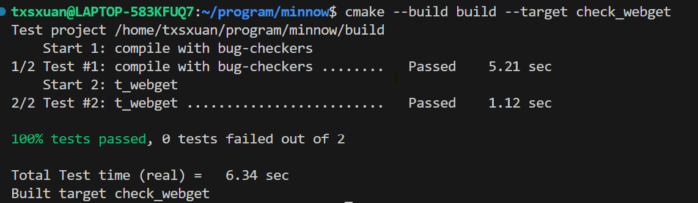
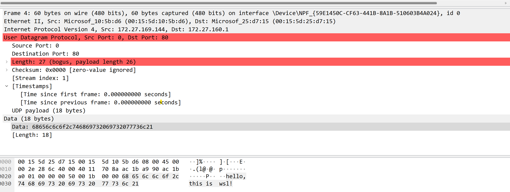
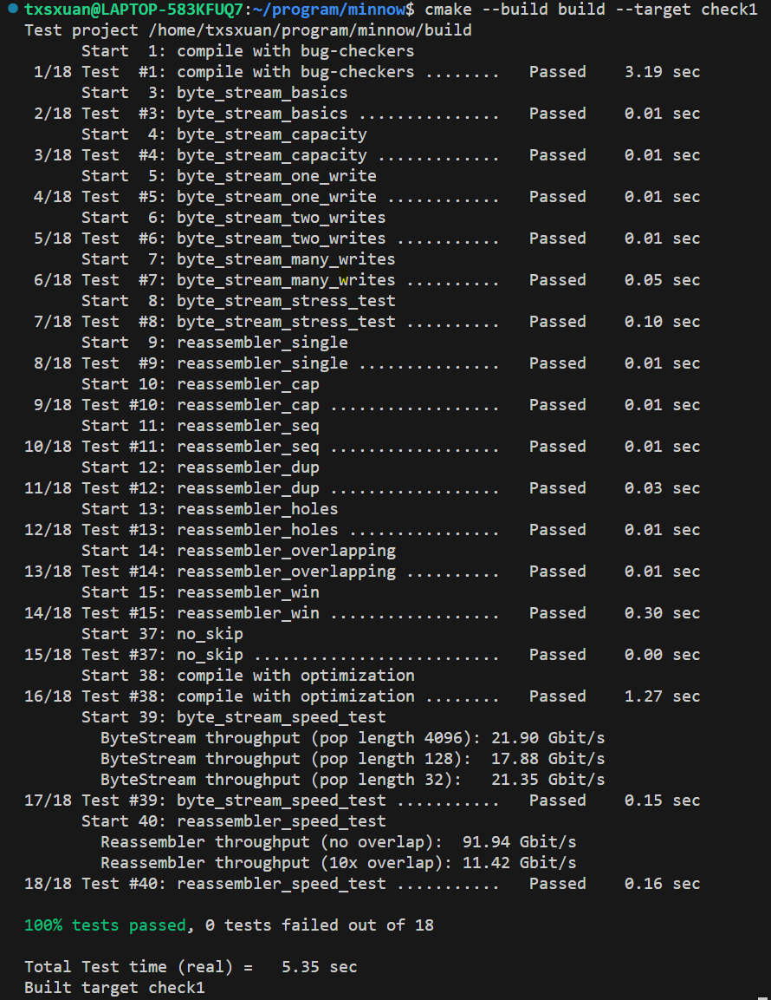

# check0

## 配置环境
谁能想到，谁能想到，这一步是耗费我时间最长的……为了配置这个工具链，我先是弄坏了我的llvm工具链，导致ubuntu的图形界面直接崩溃，后来折腾了快一天，之后更是抽象，直接连grub引导都坏了。也算是长了一点知识，比如进入tty的时候可以重新安装桌面管理器gdm，比如在grub坏掉的时候可以插入启动盘，然后进入试用ubuntu，将主要的几个磁盘挂载起来再重新安装grub，还是有办法的嘛……
最后选择在wsl中，使用llvm16工具链，主要用到了clang-16,clang++-16,clang-tidy-16,clang-format-16
## 为wsl设置代理
这也折腾死我了，最后想了个办法，直接下一个xray，写写配置文件就行，easy
## 阅读代码
按照文档要求，需要阅读utils目录下的代码
* file_descriptor.hh 
    这就是一个封装好的文件描述符，基本上是把原来的c系统调用包装成了c++类，其中最值得我学习的是以下几点
    * fcntl函数 
    file control，一般用来获取与文件相关的信息或者设置相关信息。原型是     int fcntl(int fd, int cmd, ... /* arg */ );
        * fd: linux的文件描述符
        * cmd:命令，可以设置文件或者获取文件相关的信息，支持的操作有很多，在这个文件里主要使用的是fcntl( fd, F_GETFL )，意思是获取文件相关的标志位。同理，将F_GETFL 改为F_SETFL就是设置相关的标志位，比如可以让文件是阻塞模式，也可以不是。 

    * 一种神奇的写法 
        想起之前阅读一个sdl的项目时发现的，一些大佬们喜欢在一个类里面方一个智能指针私有变量,这个智能指针可以用来实现RAII，又可以保证接口的灵活性，十分实用。

* socket.hh 
同样的是对c系统调用的包装。看代码会发现socket继承于FileDescriptor类
    * extern int socket (int __domain, int __type, int __protocol) 
    这是glibc中对linux系统调用的封装，主要接收三个参数。第一个用来指示协议族,例如AF_INET（IPv4）、AF_INET6（IPv6）、AF_UNIX（本地 Unix 套接字） 
    第二个用来标识套接字类型，可以是SOCK_STREAM（TCP 流式套接字）或者SOCK_DGRAM（UDP 数据报套接字）。 
    第三个参数用来表示协议类型，通常为0，默认匹配。
    * extern int shutdown (int __fd, int __how) __THROW; 

    | `__how` | 宏定义 | 作用 |
    |------------|----------------|-------------------------------|
    | `0` | `SHUT_RD` | 关闭**读取**方向，不能再接收数据，但仍可发送数据 |
    | `1` | `SHUT_WR` | 关闭**写入**方向，不能再发送数据，但仍可接收数据 |
    | `2` | `SHUT_RDWR` | 关闭**读写**方向，完全断开连接 |
    * 
## 编写webget
* http文件头要求结尾必须是"\r\n"
* 需要使用address，而框架代码支持一种用主机+端口的方式传入，由于会调用getaddrinfo，它要求第二个参数也就是端口号必须是字符串类型，这里比较坑
* 在最后一行的时候必须用两次"\r\n"，因为第二个\r\n用来表示http头的结束
* 通过

## in-memory reliable byte stream
过程相比之前有了一些痛苦的地方，总的来说还是比较简单的也涨了一点芝士
* queue 
    很显然需要一个先进先出的数据结构，所以采用队列实现（不需要随机访问，而需要快速的从队首pop元素和从队尾存入一个元素。
* string_view 
    这是一个不需要复制字符串但是能访问字符串的类，它甚至可以接受一个c字符串，根据GPT所言，const std::string &是做不到这种的。需要注意的是，它并不会复制一个字符串，因此如果用一个临时变量来构造它会出现很危险的事情。比如string_view{queue.front().substr}，这里的substr只会返回一个临时的字符串
* peek 
    这是这个问题的真正关键，也是决定了速度。
    这里涉及了一个string_view::remove_prefix的概念，记录队首被删掉的字符，如果整个字符被删掉再pop出来

# check1
## 使用socket发送udp报文 
    这个任务非常的简单，唯一掌握的新知识就是报文要一个一个字节的写，同时，checksum为0可以认为是不需要检验，否则都需要手动计算，还有length字段一定不能错！

## ressembler
    目前写的最红温的一个部分，写了一大堆代码，遇到各种问题（其实大部分是因为没有充分理解需求导致的），打算之后看看大佬的实现，这里测试过了，先不管了。

最大的收获是阅读了一部分测试的代码，有空的话需要学习这部分测试代码

> 2025-04-13 13:40 

换成了ubuntu真机，本周开始继续努力

